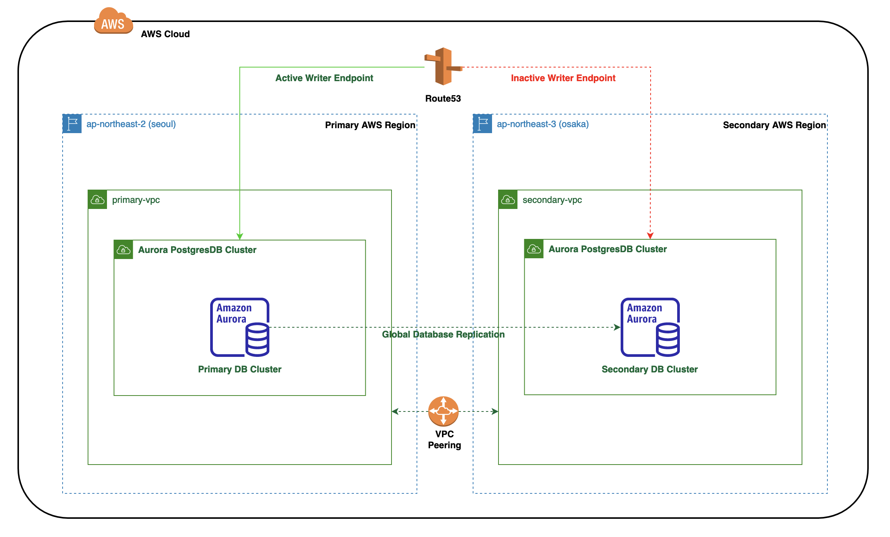
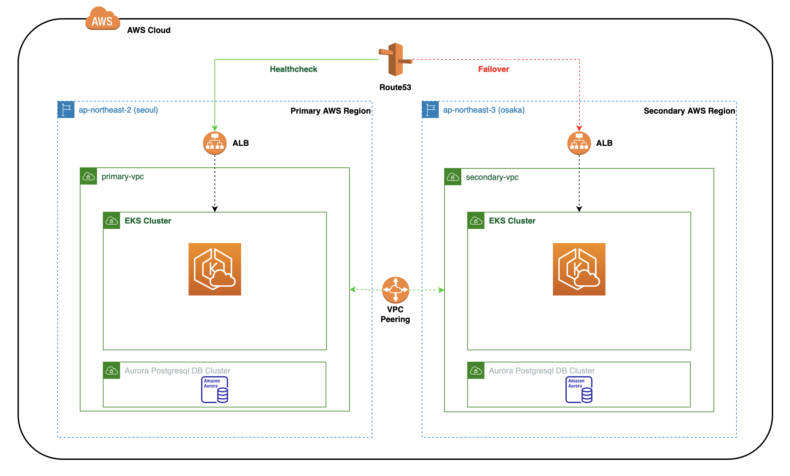

# eks-infra

### Introduction

This code creates a system as mentioned in the [assignment.md](ASSIGNMENT.md). System comprises of:
- a multi-region EKS cluster (two clusters running in primary and secondary aws regions)
- Aurora PostgreSQL DB cluster which span across aws regions (making use of [aurora global database feature](https://aws.amazon.com/rds/aurora/global-database/))
- each EKS cluster running a [todo application](https://github.com/milindchawre/todo/tree/multi-region)

### Architecture
**EKS Cluster Architecture**

**Aurora PostgreSQL DB Cluster Architecture**

**Automatic DNS Failover Mechanism**

### Deployment
To deploy the system:
- first you need to setup the pre-requisites resources on AWS by following [this guide](infrastructure/pre-requisites/README.md).
- later you actually deploy the EKS cluster using [this guide](infrastructure/eks-setup/README.md).
- the aurora postgresql database that spans across AWS regions is configured using [this guide](infrastructure/db-setup/README.md).
- deploy the application on top of the cluster by following [this guide](https://github.com/milindchawre/todo/blob/multi-region/README.md).

### Contribution
Refer [contribution guide](contributing.md).
