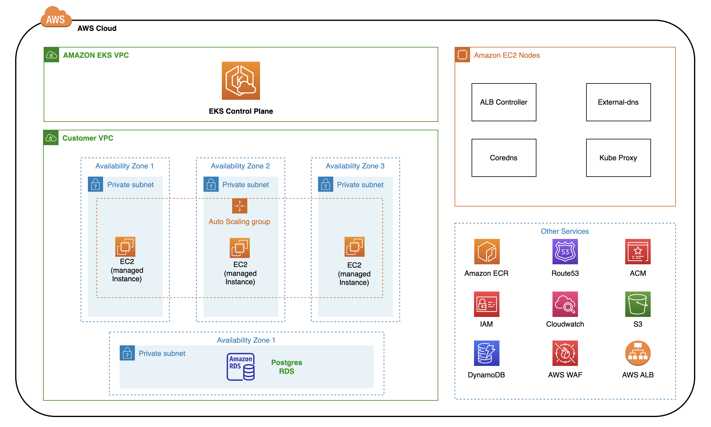

# eks-infra

### Introduction

This code creates a system as mentioned in the [assignment.md](ASSIGNMENT.md). System comprises of an EKS cluster running a [todo application](https://github.com/milindchawre/todo).

### Architecture

### Deployment
To deploy the system:
- first you need to setup the pre-requisites resources on AWS by following [this guide](infrastructure/pre-requisites/README.md).
- later you actually deploy the EKS cluster using [this guide](infrastructure/eks-setup/README.md).
- deploy the application on top of the cluster by following [this guide](https://github.com/milindchawre/todo/blob/main/README.md).

### Contribution
Refer [contribution guide](contributing.md).
