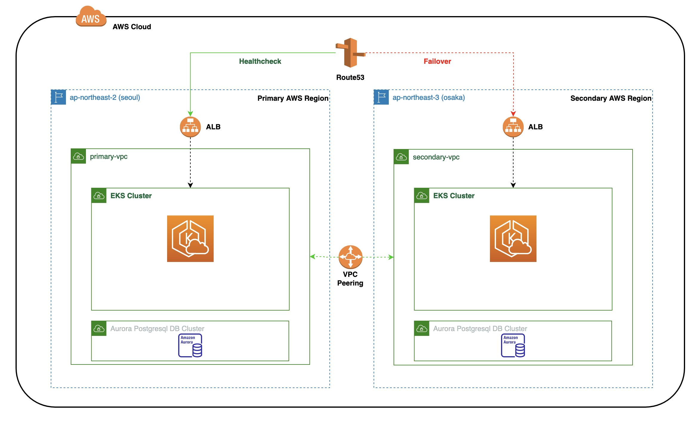

# System Failover

## Intro
We need to ensure our application is highly available and resilient to failure. In our multi-region setup, there are three possible failure scenarios: Application pod failure or database failure or both (in case of aws region failure). Let us see how these three failure scenarios are handled in our system.

## System overview
Before we deep dive into failure scenarios, let me give you a quick overview of our system.

Our system is multi-region setup, so it span across two AWS regions: Seoul (ap-northeast-2) and Osaka (ap-northeast-3). Each AWS region consist of an EKS cluster and Aurora PostgreSQL DB cluster (DB cluster spans across AWS region using aurora global database feature).

The application that runs on EKS is a todo application which runs as a pod inside EKS and it interacts with aurora PostgreSQL DB.

## System failure
There are three possible scenarios in which our system might fail: Application pod failure or database failure or both (in case of aws region failure).

### Application pod failure
If todo application pod running in one of the EKS cluster fails, then we need to ensure that the application is still accessible to our end user without any service disruption. To achieve this we need automatic dns failure. Prior to that we need few things. A single dedicated DNS record that points to application url of both apps running on separate clusters in separate AW regions. Also we need to ensure this dedicated DNS records directs traffic to only healthy application url. To achieve both of these requirement, we make use of route53 failover dns records, in which we define primary dns record that points to application running in our primary cluster while the secondary dns records points to application running in secondary cluster. Both the primary and secondary dns records have route53 healthcheck attached that determines whether the endpoint is healthy or unhealthy. Based on these health check, the automatic dns failover occurs in case of failure.

### Database failure
Our system make use of [aurora postgreSQL global database](https://aws.amazon.com/rds/aurora/global-database/), running in primary and secondary AWS region. The one in primary region, has a writer DB instance and all other DB instances in the cluster are in reader mode. In application configuration, we point to writer DB endpoint of primary region. If the DB in primary region fails, the aurora DB will take care of automatic failover where the DB running in secondary region will become writer. It just that as an end user, we need to update the [application configuration to point to new healthy writer DB endpoint](https://github.com/milindchawre/todo/blob/multi-region/helm-chart/todo-service/values-seoul-prod.yaml#L15-L18). So there is automatic failover for DB, but it needs application user to update the configuration. It is possible to have a separate dns record pointing to writer DB instance of healthy endpoint by making use of tools like route53 failover records, but its not yet implemented in our solution.

### AWS region failure (both Application and DB failure)
In case of AWS region failure, both our application and DB running in AWS region will fail. In this situation, both the application and db failure should happen. So in nutshell, if primary AWS region goes down then secondary will become primary to serve all requests for the end users.

# References
- Aurora Global Database Failover: https://docs.aws.amazon.com/AmazonRDS/latest/AuroraUserGuide/aurora-global-database-disaster-recovery.html
- Aurora PostgreSQL Global database: https://aws.amazon.com/blogs/database/aurora-postgresql-disaster-recovery-solutions-using-amazon-aurora-global-database/
- Route53 failover routing policy: https://docs.aws.amazon.com/Route53/latest/DeveloperGuide/dns-failover-types.html
